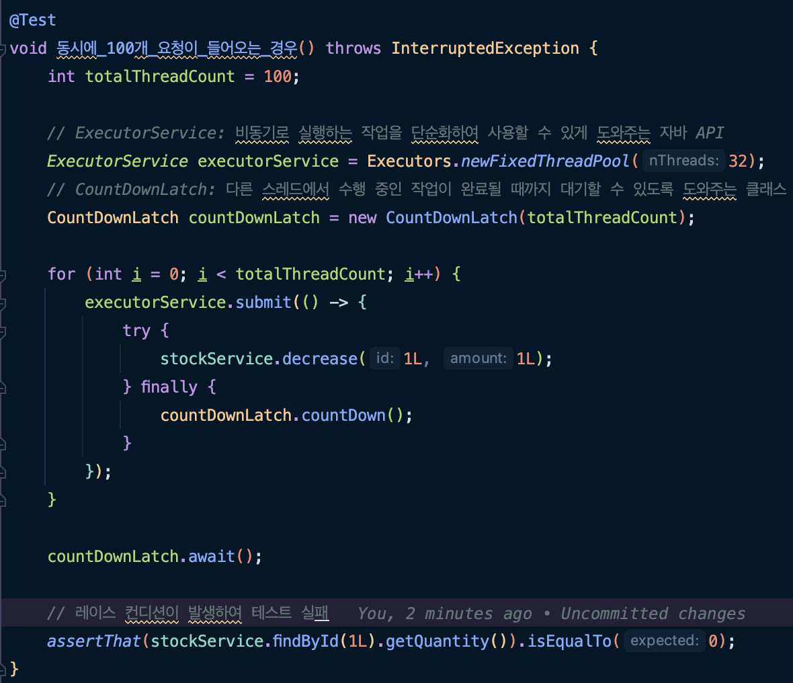
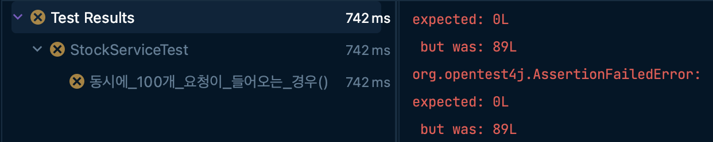
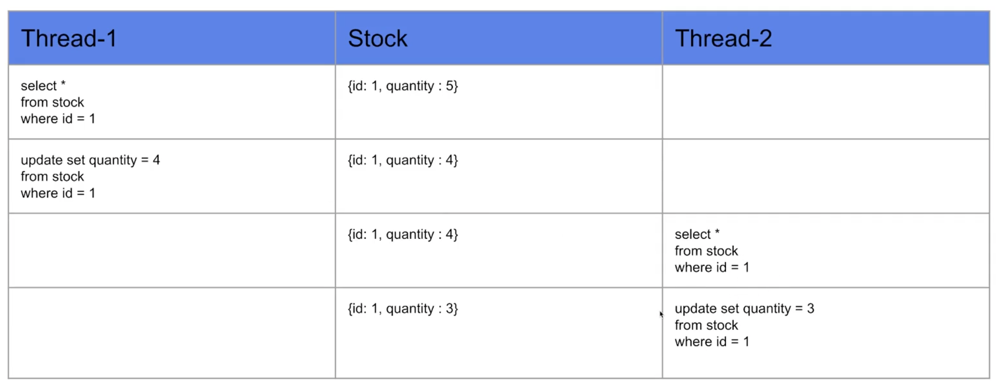
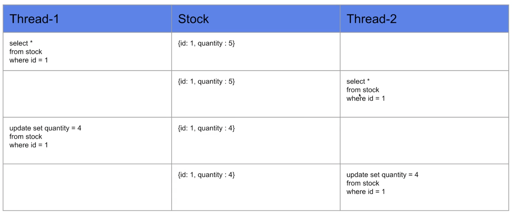

## 테스트 코드

## 테스트 결과

### 테스트가 실패하는 이유
-> 레이스 컨디션이 발생했기 때문
* 레이스 컨디션(Race Condition)
: 둘 이상의 스레드가 공유 데이터에 액세스할 수 있고 동시에 변경하려고 할 때 발생하는 문제

 

우리가 기대하는 스레드 간 수행 순서는 아래와 같지만

 

실제로는 한 스레드가 갱신하기 전 다른 스레드가 공유 데이터에 접근할 수 있기 때문에 값이 정상적으로 변경되지 않는다.
