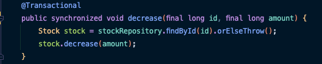
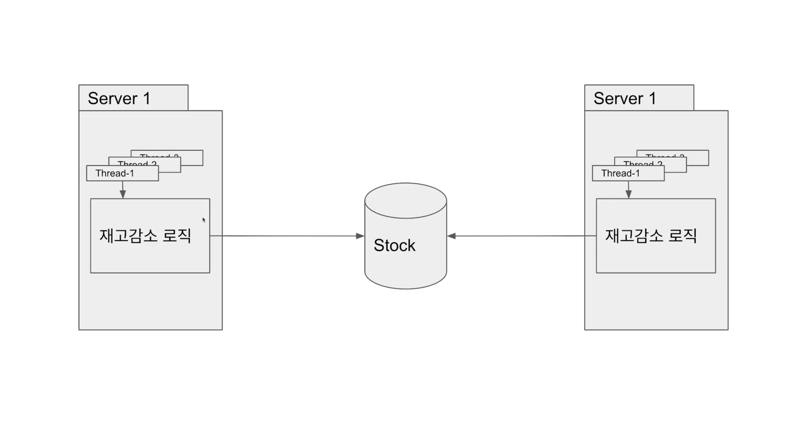

## Synchronized 를 붙여도 테스트를 통과하지 못하는 이유

-> 스프링의 `@Transactional` 어노테이션의 동작 방식 때문
* `@Transactional` 은 타킷 클래스를 wrapping 한 프록시 클래스를 사용
~~~java
public class TransactionStockService {
    
    private StockService stockService;
    
    ...
    
    public void decrease(Long id, Long quantity) {
        startTransaction();
        
        stockService.decrease(id, quantity);
        
        // 실제 데이터베이스에 반영하기 전에 다른 스레드가 decrease() 를 호출할 수 있고
        // 다른 스레드는 갱신되기 전의 값을 가서 작업을 수행하므로 동일한 문제 발생
        endTransaction();
    }
    
    ...
}
~~~

 

## 해결 방법 1
`@Transactional` 을 제거하고 `synchronized` 로 임계 구역을 보호한다.
* 임계 구역: 여러 스레드가 동시에 접근해서는 안되는 공유 자원을 사용하는 코드

 

## 해결 방법 1의 문제점
`synchronized` 의 데이터 thread-safe는 동일 프로세스 내에서만 보장된다.

실제 서비스 운영 환경에서는 여러 대의 서버를 두기 때문에 결국 같은 문제가 발생하게 된다.
