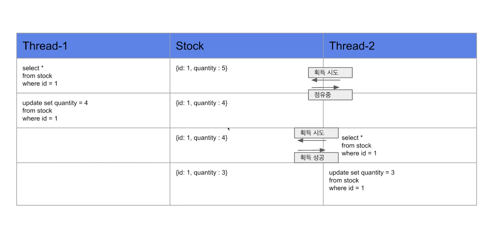
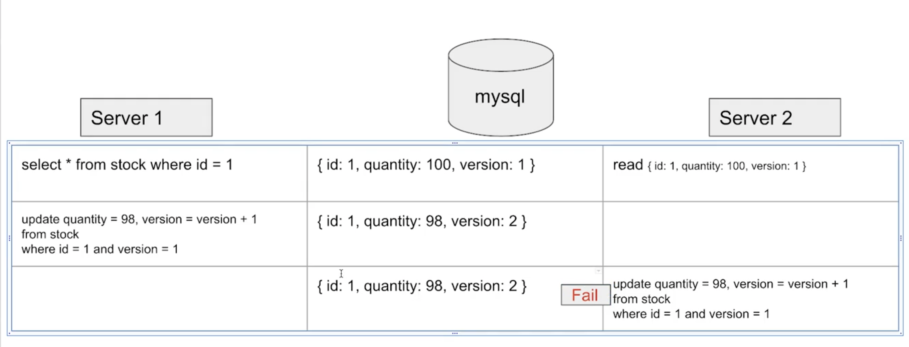
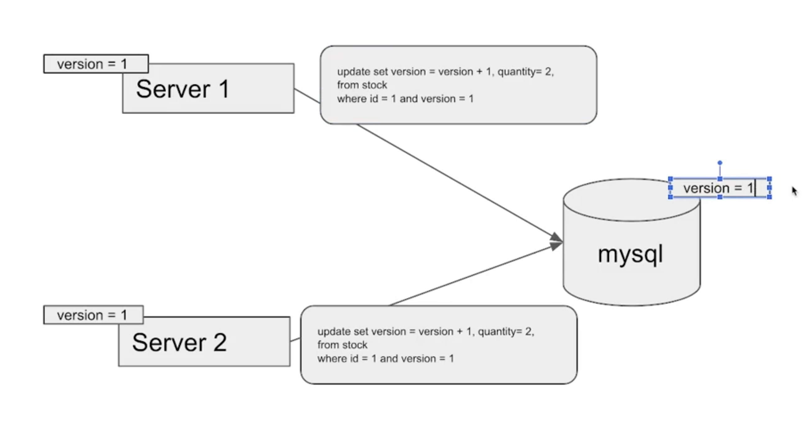
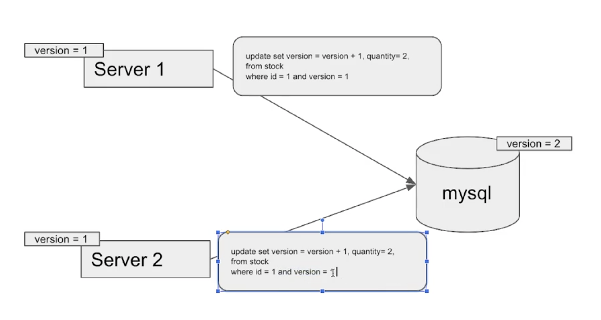
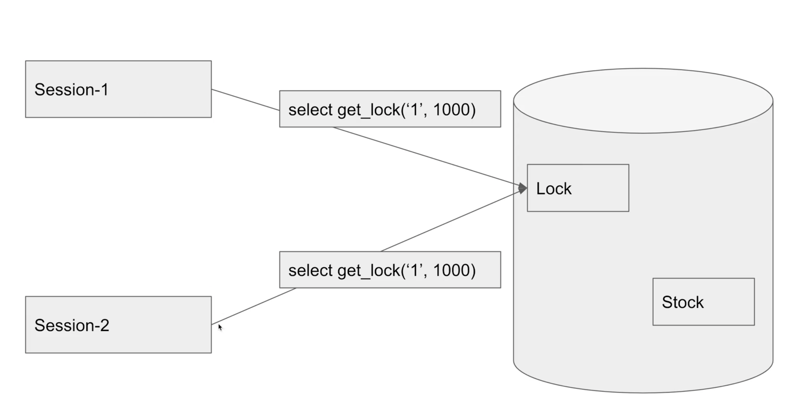

## 데이터베이스를 활용하여 레이스 컨디션 해결해보기
JPA의 영속성 컨텍스트를 적절히 활용하면 DB 트랙잭션이 `READ COMMITTED` 격리 수준이어도 애플리케이션 레벨에서 `REPEATABLE READ` 가 가능하다.

JPA는 DB 트랜잭션 격리 수준을 `READ COMMITTED` 정도로 가정한다.

만약 일부 로직에 더 높은 격리 수준이 필요하면 낙관적 락과 비관적 락 중 하나를 사용하면 된다.

1. Pessimistic Lock (Exclusive lock)
   * 실제로 데이터에 lock을 걸어서 정합성을 맞추는 방법
   * 어떤 트랜잭션이 Exclusice lock을 걸게 되면 다른 트랜잭션은 lock이 해제되기 전까지 특정 row의 lock을 얻을 수 없음
      
      * A 트랜잭션이 끝날 때까지 기다렸다가 B 트랜잭션이 lock을 획득
   * 특정 row를 update 하거나 delete 할 수 있다.
   * 일반 select 는 별다른 lock이 없기 때문에 가능
   * 데드락이 걸릴 수 있으므로 주의해서 사용

    

2. Optimistic Lock
   * 실제로 lock을 이용하지 않고 버전을 이용하여 정합성을 맞추는 방법
     * ex) version column을 만들어서 해결
   * 데이터를 읽고 update를 수행할 때 현재 내가 읽은 버전이 맞는지 확인하며 갱신
      
     * 내가 읽은 버전에서 수정사항이 생겼을 경우에는 어플리케이션에서 다시 읽은 후에 작업을 수행해야 함

       

   서버1과 서버2가 같은 버전에 대해 갱신을 시도하려고 할 때,   

    
   
   서버1이 데이터베이스에서 갱신 대상 데이터의 버전을 확인 후 데이터 갱신 시도. 갱신이 성공한다면 버전을 하나 올린다.  
   

     

   서버2이 데이터베이스에서 갱신 대상 데이터의 버전을 확인 후 데이터 갱신을 시도하지만 버전이 달라 어플리케이션에서 데이터를 다시 읽어와야 한다.
   

    

3. Named Lock
   * 고유한 이름을 식별되는 잠금 (MySQL 에서만 제공)
     * https://dev.mysql.com/doc/refman/8.0/en/metadata-locking.html
   * 이름을 가진 락을 획득한 후 해제할 때까지 다른 세션에서는 락을 획득하거나 해제할 수 없다.
   * 트랜잭션이 종료될 때 락이 자동으로 해제되지 않으므로 별도의 명령어를 통해 해제하거나 선점 시간이 끝나야 해제된다.
   * Pessimistic Lock과 비슷하지만 Pessimistic Lock에서 다루는 데이터 단위는 로우나 테이블 정도인 반면 Named Lock은 테이블 뿐만 아니라 스키마, 저장된 프로그램(프로시저, 함수, 트리거, 예약된 이벤트), `GET_LOCK()` 함수로 획득한 사용자 잠금, locking service로 획득한 잠금도 포함된다.
   * `GET_LOCK()` 함수로 획득하고 `RELEASE_LOCK()` 함수로 해제한다.
   * 주로 분산 락을 구현할 때 사용한다.
   * Pessimistic Lock보다 타임아웃을 구현하기 쉽다.
   * 하지만 실제로 구현하기에는 어렵다.

     

   
   * Named Lock은 타겟 로우나 테이블이 아닌 별도의 공간에 락을 건다.
   * A 세션이 1 이라는 이름으로 Named Lock을 얻게 되면 다른 세션은 A 세션이 락을 해제할 때까지 사용하지 못한다.  