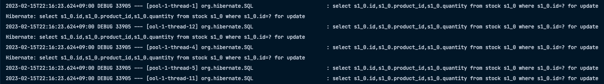

## 비관적 락 
* 트랜잭션의 충돌이 발생한다고 가정하고 우선 락을 걸고 보는 방법

JPA의 비관적 락은 데이터베이스 트랜잭션 메커니즘에 의존하는 방법이다.

대표적으로 `select for update` 구문이 있다.

 

* 특징
  * 엔티티가 아닌 스칼라 타입을 조회할 때도 사용할 수 있다.
  * 데이터를 수정하는 즉시 트랜잭션 충돌을 감지할 수 있다.

 

* 장점: 충돌이 자주 일어날 떄 Optimistic Lock 보다 성능상 이점이 있다.
* 단점
  * 데이터에 직접 락을 걸게 되므로 성능 감소가 있을 수 있다.
  * 락을 잡고있는 트랜잭션의 작업이 길어지면 데이터베이스 커넥션의 수가 모자라게 되는 문제가 생길 수 있다. 
    
    -> 이와 관련없는 다른 요청들도 처리하기가 어려워지므로 서비스 자체가 느려지게 된다.

 

* 발생하는 예외
  * PessimisticLockException(JPA예외)
  * PessimisticLockingFailureException(스프링 예외 추상화)

 

### PESSIMICTIC_WRITE
비관적 락이라면 일반적으로 이 옵션을 말한다.

데이터베이스 쓰기 락을 걸 때 사용한다.

* 용도: 데이터베이스에 쓰기 락을 건다.
* 동작: 데이터베이스 `select for update` 를 사용해서 락을 건다.
* 이점: `NON-REPEATABLE READ` 를 방지한다. 락이 걸린 로우는 다른 트랜잭션이 수정할 수 없다.

 

### PESSIMICTIC_READ
데이터를 반복 읽기만 하고 수정하지 않는 용도로 락을 걸때 사용한다.

일반적으로 잘 사용하지 않는다.

데이터베이스 대부분은 방언에 의해 PESSIMISTIC_WRITE로 동작한다.

* MySQL: lock in share mode
* PostgreSQL: for share

 

### PESSIMISTIC_FORCE_INCREMENT
비관적 락중 유일하게 버전 정보를 사용한다.

비관적 락이지만 버전 정보를 강제로 증가시킨다.

하이버네이트는 `nowait` 를 지원하는 데이터베이스에 대해서 `for update nowait` 옵션을 적용합니다.

* 오라클: for update nowait
* postgreSQL: for update nowait
* nowait을 지원하지 않으면 for update가 사용됩니다.

 

### 타임 아웃
비관적 락을 사용하면 락을 획득할 때까지 트랜잭션이 대기하게 되는데 무한정 기다릴 수 없으므로 타임아웃 시간을 줄 수 있다.

* ex)
~~~java
public interface StockRepository extends JpaRepository<Stock, Long> {

    @Lock(LockModeType.PESSIMISTIC_WRITE)
    @Query("select s from Stock s where s.id = :id")
    @QueryHints({@QueryHint(name = "javax.persistence.lock.timeout", value ="10000")})
    Optional<User> findByIdWithPessimisticLock(Long id);
}
~~~