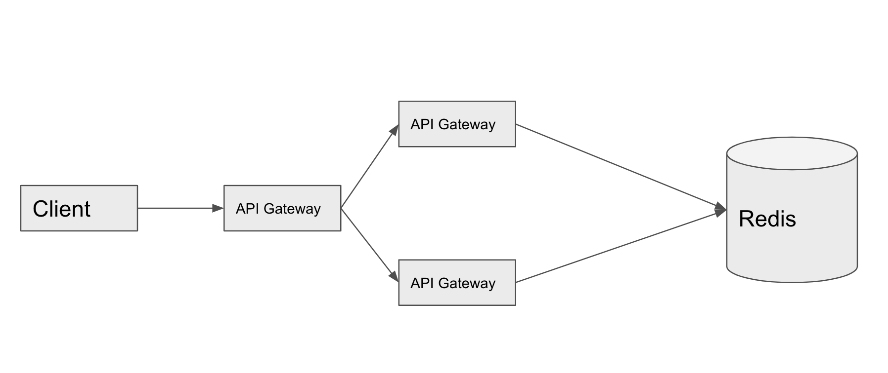
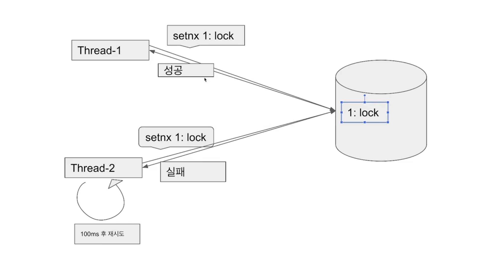
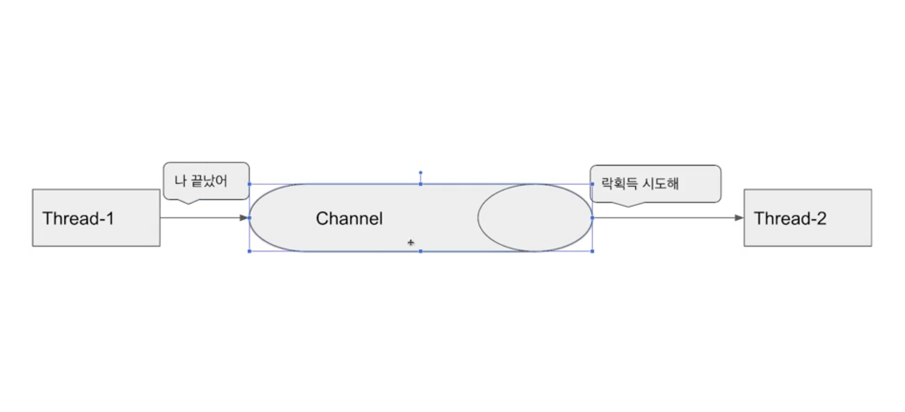

## 분산 락
* 여러 서버를 운영하는 분산 환경에서는 한 서버에 락이 걸려있어도 다른 서버로 동일한 요청이 가게 된다면 동기화를 보장할 수 없다.
* 이때 분산 락은 데이터베이스 등 공통된 저장소를 이용하여 자원이 사용 중인지를 확인하기 때문에 전체 서버에서 동기화된 처리가 가능하다.

  

## Redis를 활용한 인프라 구조 예시

  

## Redis 라이브러리
Redis는 싱글 스레드 기반으로 실행되기 때문에 기본적으로 atomic하게 연산을 수행한다.

Redis를 활용하여 분산 락을 구현할 때 사용하는 라이브러리는 다음과 같다.

### Lettuce
* `setnx` 명령어를 활용하여 분산 락 구현
  * `setnx`
    * “SET if Not eXists” 의 줄임말
    * 특정 key에 값이 존재하지 않을 때만 값을 설정할 수 있다.
  * MySQL의 `GET_LOCK` 함수와 비슷하지만 MySQL과 다르게 세션 관리를 따로 하지 않아도 된다.
* 스핀 락 방식으로 개발자가 직접 retry 로직을 구현해야 한다.
  * 스핀 락
     
    -> 획득하려는 스레드가 락을 획득할 수 있는지 반복적으로 확인하면서 락을 획득하는 방식
  * 장점
    * spring data redis 라이브러리가 기본적으로 lettuce를 사용하기 때문에 별도의 라이브러리가 필요없다. 
    * 락을 점유하는 시간이 짧을 경우 유용하다.
  * 단점
    * setnx 명령어는 expire time을 설정할 수 없기 때문에 락의 타임 아웃 로직은 직접 구현해야 한다.
    * 스레드가 락을 오래 유지하는 경우 다른 스레드들이 계속해서 락의 획득을 시도하므로 Redis에 부담을 줄 수 있다.

 

### Redisson
* pub-sub 기반으로 락 구현 제공
  * pub-sub
     
    * `subscribe` 명령어로 특정 채널을 구독
    * `publish` 명령어로 특정 채널에 메시지를 발행
    
    -> 락을 점유 중인 스레드가 채널을 통해 락 획득을 대기 중인 스레드에게 해제를 알려주고, 메시지를 받은 스레드만 락 획득을 시도하는 방식
    
    -> 스핀 락 방식에 비해 레디스에 부담이 덜 감
* 장점
  * 별도의 retry 로직을 구현하지 않아도 된다.
    * 락 획득에 실패하면 계속해서 Redis 서버에 재확인하지 않고, 메시지가 올 때까지 대기 상태로 있게 된다.
  * 락에 타임 아웃을 설정할 수 있다.
* 단점
  * 별도의 라이브러리를 사용해야 한다.
  * 락을 라이브러리 차원에서 제공해주기 때문에 사용법을 익혀야 한다.

 

### 실무에서는?
* 재시도가 필요하지 않은 경우에는 lettuce 활용
  * ex) 선착순 1명만 물건을 구매할 수 있는 상황
* 재시도가 필요한 경우에는 redisson 를 활용
  * ex) 일반적인 주문 상황
